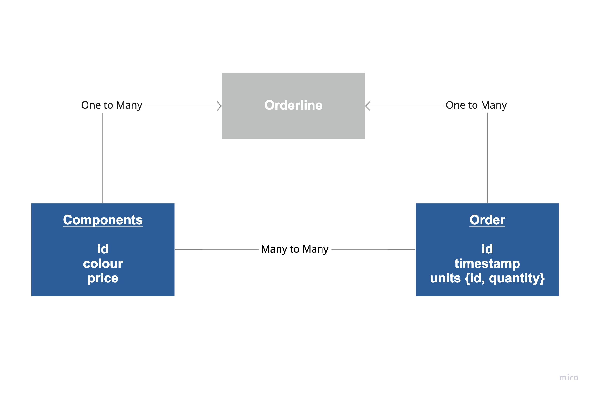

# Coding Exercise

This repo contains code to process orders data and components data and then perform some data analysis

<br>

## Running the code
With the required packages installed (found in requirements.txt), the project can be run with: 
`python run_project.py` 

Similarly, the tests can be run with:
`python run_tests.py`

<br>

## Project Structure

```
project
└─── data       
└─── logs
└─── output         # the results are stored here
└─── src
│    └─── data_ingestion.py
│    └─── data_transformation.py
│    └─── data_analysis.py
│    └─── test_data_transformation.py
│    └─── test_data_analysis.py
│    
│-README.md
│-run_project.py    
│-run_tests.py 
│-requirements.txt  
```

<br>

## Data Model


<br>

## Next steps
Potential next steps include:
- Improving test coverage. Most of the business logic is tested but more could be done (including refactoring I/O functions to be more easily testable)
- Implement type checking during data ingestion
- Refactor to handle multiple, consecutive runs without overwriting data (e.g. daily runs)
- Move the high-level function arguments such as dates to a configuration file